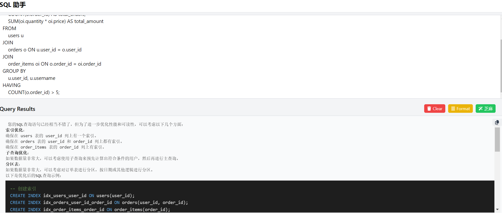
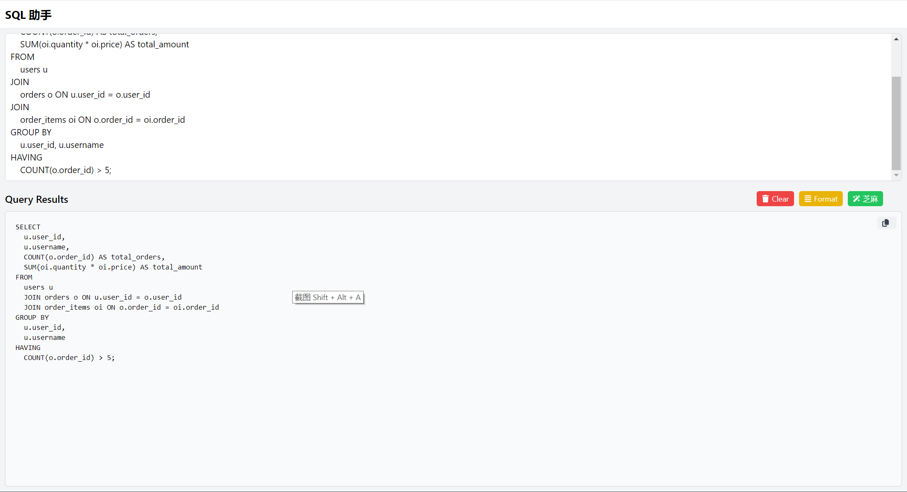

# SQL AI Assistant

SQL AI Assistant is a web-based tool designed to help developers and database administrators quickly format and execute SQL queries while providing AI-driven optimization suggestions. In the future, this project aims to evolve into an online tool, allowing users to utilize these features directly in their browser.

## Features

1. **AI Optimization Suggestions**: Leverages AI technology to analyze queries and offer optimization recommendations, such as improving index usage and query efficiency.
2. **SQL Formatting**: Automatically formats SQL queries using the `sql-formatter` library, making them more readable.
3. **SQL Query Execution**: Allows users to input SQL queries and run them, with query results displayed (feature coming soon).
4. **Tab Switching**: Users can toggle between tabs to view formatted SQL queries or AI optimization suggestions.
5. **Simple User Management**: Provides login functionality, enabling users to save query history and optimization suggestions (upcoming feature).

[Try it online](https://www.sesamesql.com)




## Usage Instructions

### 1. Installation

To run this project locally, ensure you have the following tools installed:

- [Tailwind CSS](https://tailwindcss.com/): For styling the page
- [sql-formatter](https://github.com/sql-formatter-org/sql-formatter) and [Highlight.js](https://highlightjs.org/): For SQL syntax highlighting and formatting

Clone this repository:

```bash
git clone https://github.com/yerdos/ZhimaSql.git
cd sql-helper
